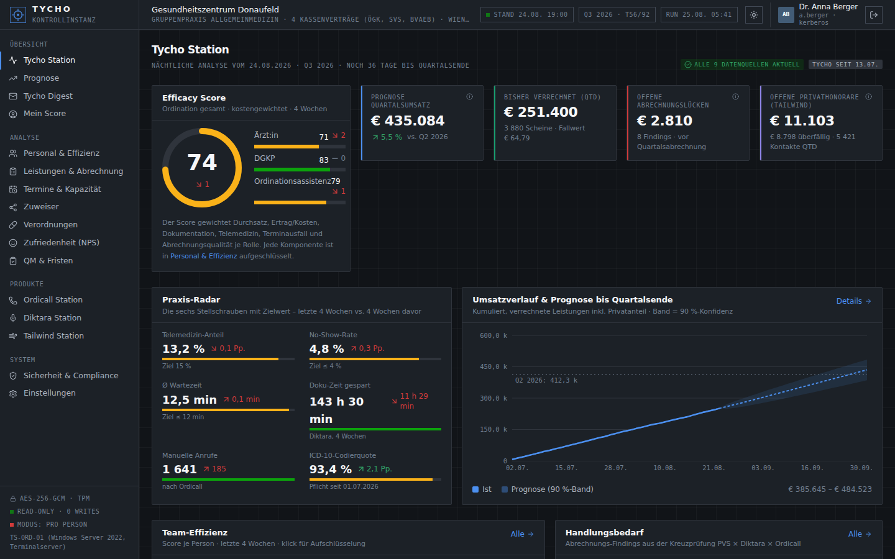
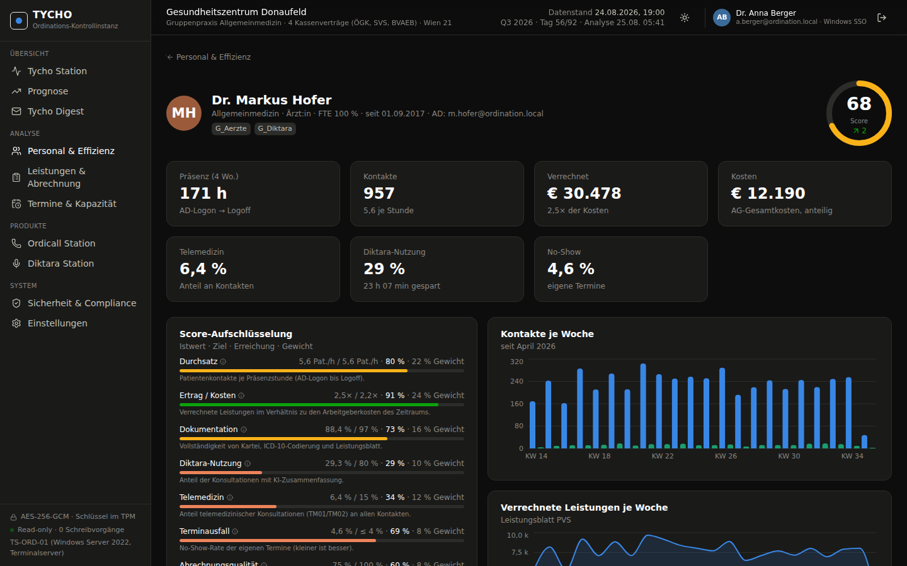
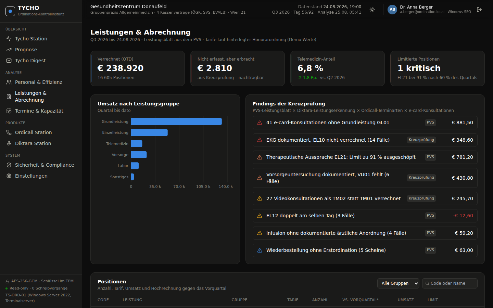
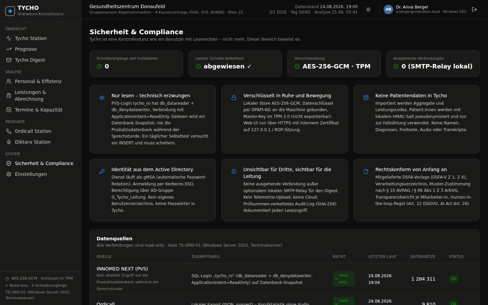
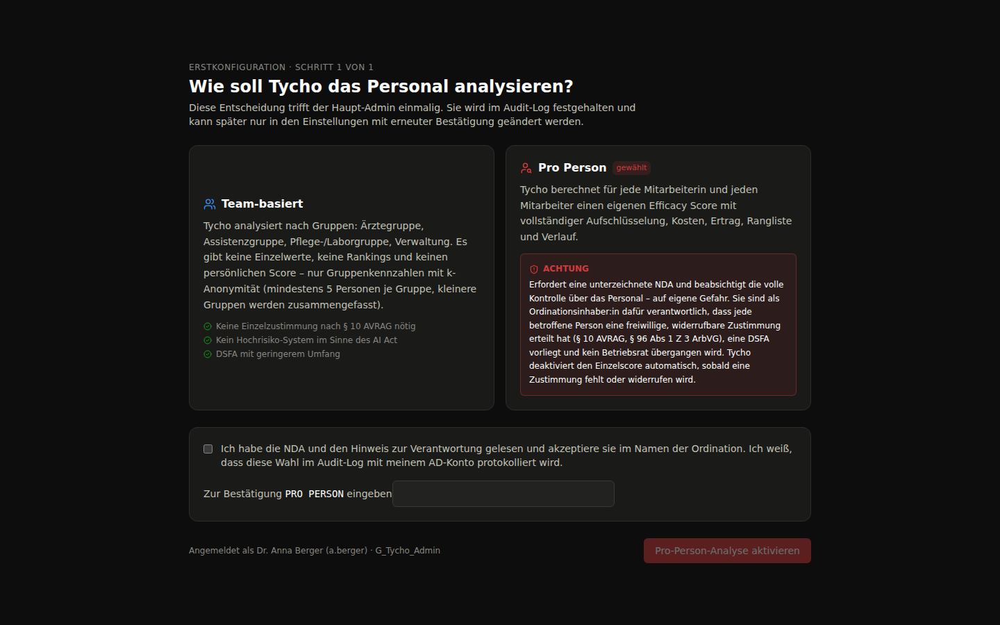
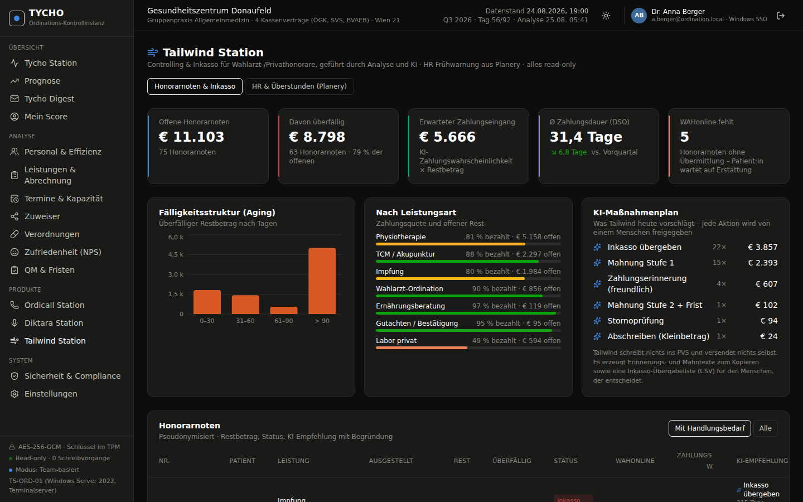

# TYCHO – Kontrollinstanz für die Ordinationsleitung

> Arbeitstitel, inspiriert von Tycho Station. „Palantir für Ärzt:innen“: Tycho bündelt die Daten aus PVS, Ordicall (Telefon-KI), Diktara (KI-Dokumentation), Patientenaufrufsystem und Active Directory zu **einem Efficacy Score**, einer **Prognose bis Quartalsende** und einem **wöchentlichen Digest** – ausschließlich lesend, lokal, verschlüsselt.

## Die vier Regeln

| Regel | Umsetzung |
|---|---|
| **Nur lesen.** Tycho schreibt nie in eine Datenbank. | Eigener DB-Login mit `db_datareader` + `db_denydatawriter`, `ApplicationIntent=ReadOnly`, Lesen von Datenbank-Snapshots/VSS-Kopien, täglicher Selbsttest, der einen Schreibversuch nachweislich scheitern lässt. |
| **Nicht bemerkbar.** Kein Eingriff in den Betrieb. | Analyse nach Betriebsschluss auf Snapshot-Daten, kein Zugriff auf die Produktivdatenbank während der Sprechstunde, keine Plugins im PVS, keine Agenten auf Arbeitsplätzen. |
| **Wie ein Benutzer.** Tycho ist eine Kontrollinstanz mit Benutzerrechten, nicht mehr. | Dienstkonto (gMSA) mit denselben Leserechten wie ein Auswertungs-Benutzer, Anmeldung per Windows-SSO, Berechtigung über AD-Gruppe `G_Tycho_Leitung`. |
| **100 % verschlüsselt und sicher.** | AES-256-GCM für den lokalen Store, Schlüssel per DPAPI-NG an die Maschine gebunden, Master-Key im TPM 2.0, HTTPS auf `127.0.0.1`, kein Cloud-Upload, keine Telemetrie, SHA-256-verkettetes Audit-Log. |

## Zwei Oberflächen, ein Datenmodell

| | Simple (Standard) | Advanced |
|---|---|---|
| Für wen | Ordinationsleitung im Alltag | Analyse, Kontrolle, „Cockpit“ |
| Aufbau | Textnavigation oben (Start, Patient:innen, Finanzen, Produktivität, Ordicall, Diktara, Tailwind, Tarife, Mehr), Standort- und Zeitraumwahl rechts, **Assistent als Seitenpanel** | Modulleiste mit Icons, Sub-Header mit Ansichts-Tabs und Filtern, **Facetten-Sidebar**, KPI-Leiste, Donuts, Zeitachse (Palantir-Gotham-Stil) |
| Startseite | Begrüßung + Frage an den Assistenten + Vorschläge + „Ihre Daten sind aktuell“ | Tycho Station |
| Login | ruhige Karte | animierter Globus |
| Design | Hell und Dunkel | Dunkel und Hell |

Umschalten in **Einstellungen → Oberfläche**. Beide Modi nutzen dieselben Seiten, Filter und Daten.

## Lokaler Assistent

Rechts (Simple) bzw. als Drawer (Advanced). Beantwortet Fragen zu Umsatz, Leistungen, Patient:innen, Anrufen, Honorarnoten, HR, Score, Prognose, Zuweisern, Verordnungen, NPS, QM und Sicherheit – ausschließlich aus den lokalen Daten des gewählten Zeitraums. In der Demo eine regelbasierte Engine (`web/src/data/agent.ts`); im Produkt ein lokales LLM (llama.cpp, z. B. Llama 3.1 8B) auf dem Ordinationsserver mit Tool-Calling auf genau diese Read-only-Funktionen. Kein Cloud-Aufruf, keine Patientendaten im Prompt.

## Alles klickbar

Zeitraum (Presets, freies Datum, Vergleichszeitraum), Standort, Rolle, Kostenträger, Team, Facetten, Ansichts-Tabs, Suche (`/`), Assistent-Vorschläge und -Chips wirken auf alle Seiten. Die Zahlen werden aus Tagesdatensätzen über 12 Monate (09/2025–08/2026) berechnet.

## Was in der Demo drin ist

| Bereich | Inhalt |
|---|---|
| **Tycho Station** | Efficacy Score der Ordination (kostengewichtet, je Rolle), Prognose-Kacheln, Praxis-Radar (Telemedizin, No-Show, Wartezeit, Doku-Zeit, manuelle Anrufe, ICD-10-Codierquote), Team-Übersicht, Handlungsbedarf, Wochentrends, Tycho-Einschätzung in Klartext |
| **Prognose** | Kumulierter Umsatz mit 90 %-Band bis Quartalsende, Scheine/Fallwert, Monatsverlauf, Kostenträger (ÖGK/SVS/BVAEB/Privat), Was-wäre-wenn-Szenarien, Methodik |
| **Tycho Digest** | Montags-Mail als Vorschau (S/MIME), Versandplan, Archiv |
| **Personal & Effizienz** | Personalstamm aus AD, Score je Person mit transparenter Aufschlüsselung (Istwert, Ziel, Gewicht), Kosten vs. Ertrag, Deckungsbeitrag, Zustimmungsstatus; Personen mit „nur aggregiert“ werden nicht einzeln bewertet |
| **Tarife & Abrechnung** | Honorarkatalog nach ÖGK-Honorarordnungs-Logik (GL, 10, 18EZ, 20, 8a–8i, 8aT–8iT, PERS, TM-V/TM-T, 34, 34a, 39, 12, 13, 17, 30–32, 60, VU, MKP, 21, 50, PRIV) mit Tarif, Regel/Limitierung, Kostenträger, Rhythmus, Erbringer; **Kreuzprüfung** PVS × Diktara × Ordicall × e-card; **Fristenkalender** und geprüfte Abrechnungsregeln |
| **Patient:innen / Finanzen / Produktivität** | Simple-Ansichten nach Vorlage: Kontakte pro Tag mit Vergleichslinie, Stoßzeiten-Heatmap, Top-Leistungen; Umsatz pro Monat nach Kostenträger, Liegengelassen pro Monat; Umsatz je Ärzt:in, Telefon je Assistenz, Anliegen |
| **Landschaft** | Interaktive Systemkarte (Quellen → Collector → Store → Agent → Module), Regulatorik-Übersicht (ASVG/Gesamtvertrag, Honorarordnung, Telemedizin, ELGA/ICD-10, DSGVO/ArbVG/AI Act, MPG), Datenmodell, nächste Fristen |
| **Termine & Kapazität** | Auslastungs-Heatmap Wochentag × Stunde, No-Show nach Terminart, Wartezeit, Recall/Vorsorge-Potenzial, Patientenbindung, Arztbrief-Durchlaufzeit |
| **Tailwind Station** | Honorarnoten-Controlling & Inkasso für Wahlarzt-/Privathonorare (Physio, TCM, Impfungen, Gutachten, Labor privat): Aging, DSO, Zahlungswahrscheinlichkeit, **KI-Maßnahmenplan** je Honorarnote mit Begründung, WAHonline-Status; **HR aus Planery**: Überstunden-Frühwarnung, Urlaubsübersicht, Abwesenheiten, Krankenstände (hochsicherheitskritisch, eigene Rolle) |
| **Tailwind HR** | HR-Übersichtsplattform aus der Dienstplan-API (Planery) × Zeiterfassung × Lohnverrechnung × Ertrag: Personalkosten, Personalkostenquote pro Monat, Ertrag je Personalstunde, Effizienz je Person oder Gruppe gegen Rollenziel, Überstunden mit Zuschlag, Krankenstandsquote, Besetzung vs. Patientenaufkommen (Wochentag × Stunde), Frühwarnungen, Abwesenheiten, Verbindungsstatus |
| **Zuweiser** | ABC-Analyse, Trend, abgesprungene und neue Zuweiser mit Handlungsempfehlung |
| **Verordnungen** | Verordnungskosten je Patient:in, Generika-Quote, ÖKO-Tool-Ausreißer mit Einsparpotenzial |
| **Zufriedenheit (NPS)** | NPS aus Google-Rezensionen und Ordicall-SMS-Umfrage, Themenanalyse, Korrelation mit Wartezeit |
| **QM & Fristen** | Geräteprüfungen, Schulungen, Hygieneplan, Dokumente mit Ampel |
| **Mein Score** | Self-Service: jede:r Mitarbeiter:in sieht nur die eigenen Werte (auch ohne Leitungsrechte) |
| **Erstkonfiguration** | Switch **Team-basiert** (Gruppen, k-Anonymität) vs. **Pro Person** (NDA, Einzelzustimmungen, „volle Kontrolle auf eigene Gefahr“); wirkt global auf alle Ansichten |
| **Ordicall Station** | Anrufe je Ergebnis (KI erledigt / übergeben / verpasst), Uhrzeitprofil, Anliegen mit KI-Quote, Außerhalb-Öffnungszeiten, Wirkung auf den Empfang |
| **Diktara Station** | Nutzung je Ärzt:in, gesparte Dokuzeit, Akzeptanz, erkannte Leistungen, Datenschutz-Grenze (nur Metadaten) |
| **Sicherheit & Compliance** | Read-only-Beweise, Datenquellen mit Zugriffsweg, Zustimmungen (§ 10 AVRAG / § 96 ArbVG), DSFA-Status, AI-Act-Hinweis, Audit-Log |
| **Einstellungen** | Module an/aus (inkl. Wahlarzt-Modus, Peer-Benchmark, QM-Fristen, Lager), Datenquellen, Digest-Plan, k-Anonymität |

## Starten

```bash
cd web
npm install
npm run dev          # http://127.0.0.1:5173
# oder produktiv auf dem Terminalserver:
npm run build && npm run preview   # http://127.0.0.1:4173, statische Dateien in web/dist
```

Anmeldung: Button „Mit Windows-Konto anmelden (SSO)“ (= `a.berger`, Haupt-Admin) oder AD-Konto `a.berger` / `k.bauer` (Leitung, beliebiges Passwort). Beim ersten Start erscheint die **Erstkonfiguration** (Team-basiert vs. Pro Person). Jedes andere AD-Konto, z. B. `l.gruber` oder `m.hofer`, sieht nur den Self-Service „Mein Score“. Die Konfiguration liegt im Browser (localStorage) und lässt sich in den Einstellungen zurücksetzen.

## Repository

```
web/     Vite + React + TypeScript + Tailwind + Recharts – die Demo-Web-App
docs/    Architektur, Research (Features, Recht, Sicherheit), offene Entscheidungen
```

- [docs/architektur.md](docs/architektur.md) – Zielarchitektur des Produkts (Collector, Store, UI, Digest) und der „No-write-path“
- [docs/research-features.md](docs/research-features.md) – Feature-Research: was Wettbewerber zeigen, was Praxisinhaber:innen wollen
- [docs/research-recht-sicherheit.md](docs/research-recht-sicherheit.md) – Abrechnungskontext Österreich, ArbVG/DSGVO/AI Act, Sicherheitsbausteine
- [docs/dev-anforderung-schnittstellen.md](docs/dev-anforderung-schnittstellen.md) – **Developer-Anforderung** für Diktara, Ordicall und Planery (Datenverträge, Pseudonymisierung, Signatur, Abnahmekriterien) – zum Weitersenden
- [docs/offene-entscheidungen.md](docs/offene-entscheidungen.md) – Entschieden / noch offen

## Demo-Daten

Alle Zahlen sind deterministisch erzeugte Demo-Daten (Seed im Code) für eine fiktive Primärversorgungseinheit „Primärversorgung Zentrum“ in Wien (PVS: CGM MedXPert, Ärzt:innen mit 120 €/h Honorar) mit 4 Ärzt:innen, 2 DGKP, 4 Ordinationsassistentinnen und 1 Ordinationsmanager. Positionen und Tarife sind an eine ÖGK-Honorarordnung angelehnt, aber keine echten Tarife. Datenstand ist auf den 24.08.2026 fixiert (Q3 2026, Tag 56 von 92), damit die Prognose sichtbar bleibt.

## Screenshots

| Tycho Station | Personen-Score |
|---|---|
|  |  |

| Leistungen & Kreuzprüfung | Sicherheit & Compliance |
|---|---|
|  |  |

| Erstkonfiguration (Switch) | Tailwind Station |
|---|---|
|  |  |
